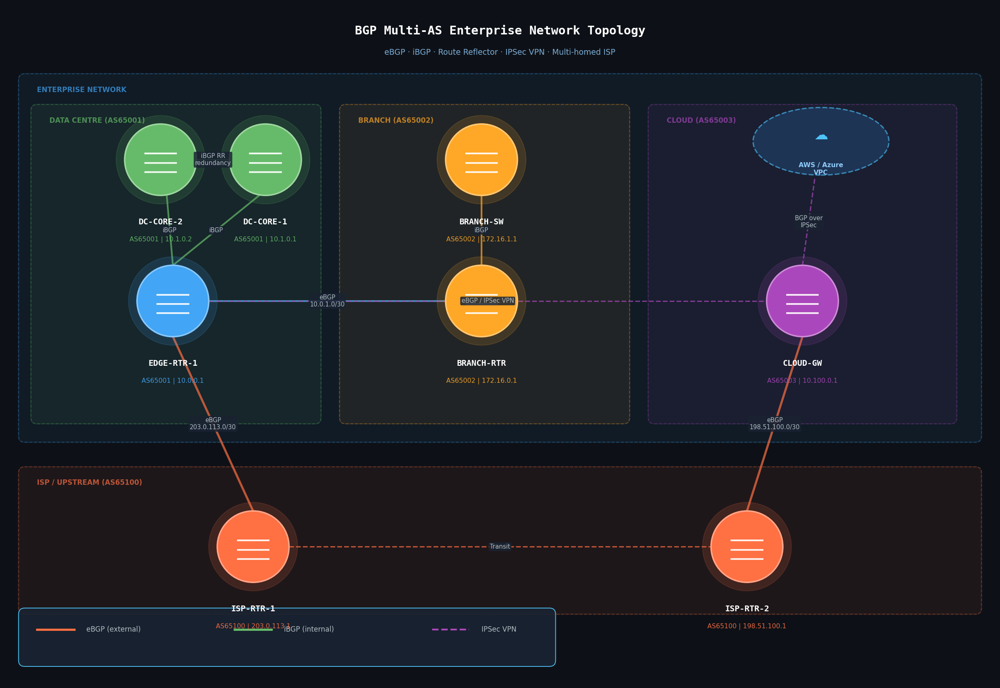

# BGP & Routing Lab — Multi-AS Enterprise Network

A practical BGP lab demonstrating multi-AS enterprise network design with eBGP, iBGP, route reflectors, multi-homed ISP connectivity, and IPSec VPN integration.

## Network Topology



## Lab Overview

| Element | Detail |
|---------|--------|
| AS65001 | Enterprise Data Centre (Cisco IOS) |
| AS65002 | Branch Office (Cisco IOS) |
| AS65003 | Cloud Gateway / AWS VPC (Juniper JunOS) |
| AS65100 | Upstream ISP (dual-homed) |
| Protocols | eBGP, iBGP, OSPF (IGP), IPSec VPN |

---

## Addressing Plan

| Device | Interface | IP Address | Description |
|--------|-----------|------------|-------------|
| ISP-RTR-1 | Gi0/0 | 203.0.113.1/30 | eBGP to EDGE-RTR-1 |
| ISP-RTR-2 | Gi0/0 | 198.51.100.1/30 | eBGP to CLOUD-GW |
| EDGE-RTR-1 | Gi0/0 | 203.0.113.2/30 | Uplink to ISP-RTR-1 |
| EDGE-RTR-1 | Gi0/1 | 10.0.1.1/30 | eBGP to BRANCH-RTR |
| EDGE-RTR-1 | Lo0 | 10.0.0.1/32 | Router ID / iBGP |
| DC-CORE-1 | Lo0 | 10.1.0.1/32 | Route Reflector |
| DC-CORE-2 | Lo0 | 10.1.0.2/32 | Route Reflector (redundant) |
| BRANCH-RTR | Gi0/0 | 10.0.1.2/30 | eBGP to EDGE-RTR-1 |
| CLOUD-GW | Gi0/0 | 10.100.0.1/30 | BGP over IPSec to enterprise |

---

## Configurations

### EDGE-RTR-1 — Cisco IOS (AS65001)

```
! ── Basic BGP ────────────────────────────────────────────
router bgp 65001
 bgp router-id 10.0.0.1
 bgp log-neighbor-changes

 ! eBGP to upstream ISP (primary)
 neighbor 203.0.113.1 remote-as 65100
 neighbor 203.0.113.1 description ISP-RTR-1-PRIMARY
 neighbor 203.0.113.1 prefix-list FILTER-IN in
 neighbor 203.0.113.1 prefix-list ADVERTISE-OUT out

 ! eBGP to branch (AS65002)
 neighbor 10.0.1.2 remote-as 65002
 neighbor 10.0.1.2 description BRANCH-RTR

 ! iBGP to DC Core Route Reflector clients
 neighbor 10.1.0.1 remote-as 65001
 neighbor 10.1.0.1 description DC-CORE-1-RR
 neighbor 10.1.0.1 update-source Loopback0

 neighbor 10.1.0.2 remote-as 65001
 neighbor 10.1.0.2 description DC-CORE-2-RR
 neighbor 10.1.0.2 update-source Loopback0

 ! Networks to advertise
 network 10.0.0.0 mask 255.255.0.0

! ── Prefix lists ─────────────────────────────────────────
ip prefix-list FILTER-IN seq 5 permit 0.0.0.0/0
ip prefix-list FILTER-IN seq 10 deny 0.0.0.0/0 le 32

ip prefix-list ADVERTISE-OUT seq 5 permit 10.0.0.0/16
ip prefix-list ADVERTISE-OUT seq 10 deny 0.0.0.0/0 le 32

! ── Route maps ───────────────────────────────────────────
route-map SET-LOCAL-PREF-PRIMARY permit 10
 set local-preference 200

route-map SET-LOCAL-PREF-BACKUP permit 10
 set local-preference 100
```

---

### DC-CORE-1 — Route Reflector Configuration (Cisco IOS)

```
router bgp 65001
 bgp router-id 10.1.0.1
 bgp log-neighbor-changes

 ! Route reflector clients
 neighbor 10.0.0.1 remote-as 65001
 neighbor 10.0.0.1 description EDGE-RTR-1
 neighbor 10.0.0.1 update-source Loopback0
 neighbor 10.0.0.1 route-reflector-client

 ! Peer with redundant RR (non-client iBGP)
 neighbor 10.1.0.2 remote-as 65001
 neighbor 10.1.0.2 description DC-CORE-2-RR
 neighbor 10.1.0.2 update-source Loopback0
```

---

### BRANCH-RTR — Cisco IOS (AS65002)

```
router bgp 65002
 bgp router-id 172.16.0.1
 bgp log-neighbor-changes

 ! eBGP to enterprise edge
 neighbor 10.0.1.1 remote-as 65001
 neighbor 10.0.1.1 description EDGE-RTR-1
 neighbor 10.0.1.1 prefix-list BRANCH-NETWORKS out

 network 172.16.0.0 mask 255.255.0.0

ip prefix-list BRANCH-NETWORKS seq 5 permit 172.16.0.0/16
ip prefix-list BRANCH-NETWORKS seq 10 deny 0.0.0.0/0 le 32
```

---

### CLOUD-GW — Juniper JunOS (AS65003)

```
set routing-options router-id 10.100.0.1
set routing-options autonomous-system 65003

set protocols bgp group ENTERPRISE-EDGE type external
set protocols bgp group ENTERPRISE-EDGE peer-as 65001
set protocols bgp group ENTERPRISE-EDGE neighbor 10.0.0.1 description EDGE-RTR-1

set policy-options policy-statement ADVERTISE-CLOUD term 1 from route-filter 10.100.0.0/16 orlonger
set policy-options policy-statement ADVERTISE-CLOUD term 1 then accept
set policy-options policy-statement ADVERTISE-CLOUD term 2 then reject

set protocols bgp group ENTERPRISE-EDGE export ADVERTISE-CLOUD
```

---

### IPSec VPN — Enterprise to Cloud (Cisco IOS)

```
! ── IKEv2 Policy ─────────────────────────────────────────
crypto ikev2 proposal IKEV2-PROPOSAL
 encryption aes-cbc-256
 integrity sha256
 group 14

crypto ikev2 policy IKEV2-POLICY
 proposal IKEV2-PROPOSAL

crypto ikev2 keyring CLOUD-KEYS
 peer CLOUD-GW
  address 10.100.0.1
  pre-shared-key LOCAL KEY-ENTERPRISE
  pre-shared-key REMOTE KEY-CLOUD

! ── IPSec Profile ────────────────────────────────────────
crypto ipsec transform-set TS esp-aes 256 esp-sha256-hmac
 mode tunnel

crypto ipsec profile CLOUD-VPN-PROFILE
 set transform-set TS
 set ikev2-profile IKEV2-PROFILE

! ── Tunnel Interface ─────────────────────────────────────
interface Tunnel10
 description VPN-TO-CLOUD-GW
 ip address 10.200.0.1 255.255.255.252
 tunnel source GigabitEthernet0/0
 tunnel destination 10.100.0.1
 tunnel protection ipsec profile CLOUD-VPN-PROFILE
```

---

## Key Concepts Demonstrated

**Multi-homed ISP connectivity** — dual uplinks to AS65100 with local preference tuning for primary/backup path selection.

**iBGP with Route Reflectors** — avoids full iBGP mesh inside AS65001. DC-CORE-1 and DC-CORE-2 act as redundant route reflectors, reducing the number of iBGP sessions needed as the network scales.

**eBGP between AS's** — enterprise edge peers with branch (AS65002) and cloud gateway (AS65003) via eBGP, allowing independent routing policy per AS.

**Prefix filtering** — inbound and outbound prefix lists on all eBGP sessions prevent route leakage and limit what is advertised to peers.

**BGP over IPSec** — cloud connectivity uses an IKEv2/IPSec tunnel with BGP running over the tunnel interface, combining encryption with dynamic routing.

---

## Verification Commands

```bash
# Cisco IOS
show ip bgp summary
show ip bgp neighbors
show ip bgp
show ip route bgp

# Juniper JunOS
show bgp summary
show bgp neighbor
show route protocol bgp
```

---

## Lab Environment

This lab can be reproduced in:
- **GNS3** — import Cisco IOS images and Juniper vSRX
- **EVE-NG** — full topology support for all platforms
- **Cisco Packet Tracer** — partial support (eBGP/iBGP only, no JunOS)

---

## References

- [RFC 4271 — BGP-4](https://www.rfc-editor.org/rfc/rfc4271)
- [RFC 4456 — BGP Route Reflection](https://www.rfc-editor.org/rfc/rfc4456)
- [RFC 7296 — IKEv2](https://www.rfc-editor.org/rfc/rfc7296)
- Cisco IOS BGP Configuration Guide
- Juniper JunOS BGP User Guide
