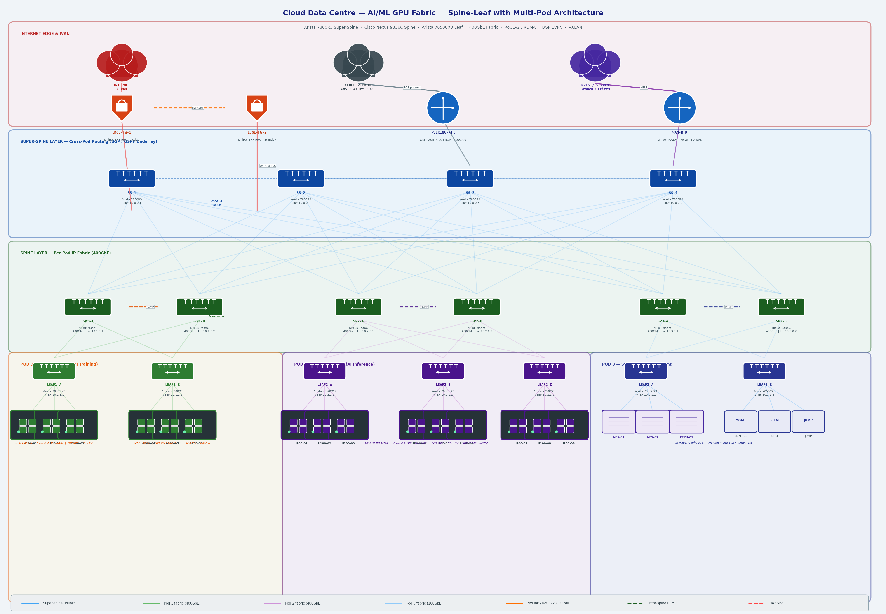

# Cloud Data Centre — AI/ML GPU Fabric with Multi-Pod Spine-Leaf Architecture

An enterprise-grade cloud data centre network designed for **AI/ML workloads**, featuring a multi-pod spine-leaf fabric with GPU clusters, RoCEv2/RDMA networking, and a super-spine layer for cross-pod routing. Reflects modern hyperscaler and cloud provider design patterns used by AWS, Meta, and Google.

---

## Network Topology



---

## Architecture Overview

This design implements a **3-tier spine-leaf fabric** with a super-spine layer to scale across multiple pods, purpose-built for latency-sensitive GPU-to-GPU communication in AI training and inference workloads.

| Layer | Device | Platform | Role |
|-------|--------|----------|------|
| Internet Edge | EDGE-FW-1/2 | Juniper SRX4600 (HA) | Perimeter firewall, Active/Passive |
| Edge Routing | PEERING-RTR | Cisco ASR 9000 | BGP peering, cloud interconnect |
| WAN | WAN-RTR | Juniper MX204 | MPLS, SD-WAN, branch connectivity |
| Super-Spine | SS-1 to SS-4 | Arista 7800R3 | Cross-pod routing, BGP RR |
| Spine | SP1-A/B to SP3-A/B | Cisco Nexus 9336C | Per-pod IP fabric, 400GbE |
| Leaf | LEAF1-A through LEAF3-B | Arista 7050CX3 | VTEP, server access |
| GPU Nodes | A100/H100 clusters | NVIDIA DGX | AI training and inference |
| Storage | NFS-01/02, CEPH-01 | — | Distributed storage fabric |

---

## Pod Design

### Pod 1 — AI Training Cluster

Optimised for large-scale distributed training workloads requiring high bisection bandwidth and low latency between GPU nodes.

| Parameter | Value |
|-----------|-------|
| GPU Type | NVIDIA A100 80GB SXM |
| GPUs per Rack | 8 × DGX A100 |
| Intra-rack interconnect | NVLink 3.0 (600 GB/s bidirectional) |
| Inter-rack interconnect | RoCEv2 over 400GbE |
| Leaf switches | 2 × Arista 7050CX3 |
| VXLAN VNI | L2: 10100 / L3: 50100 |
| Use case | LLM training, distributed deep learning |

### Pod 2 — AI Inference Cluster

Optimised for high-throughput, low-latency model serving across heterogeneous workloads.

| Parameter | Value |
|-----------|-------|
| GPU Type | NVIDIA H100 80GB SXM |
| GPUs per Rack | 8 × DGX H100 |
| Intra-rack interconnect | NVLink 4.0 (900 GB/s bidirectional) |
| Inter-rack interconnect | RoCEv2 over 400GbE |
| Leaf switches | 3 × Arista 7050CX3 |
| VXLAN VNI | L2: 10200 / L3: 50200 |
| Use case | Real-time inference, model serving, A/B testing |

### Pod 3 — Storage & Management

Centralised storage and out-of-band management serving both GPU pods.

| Parameter | Value |
|-----------|-------|
| Storage | Ceph distributed + NFS |
| Management | SIEM, Jump Host, Monitoring |
| Leaf switches | 2 × Arista 7050CX3 |
| VXLAN VNI | L2: 10300 / L3: 50300 |
| Use case | Dataset storage, model checkpoints, OOB management |

---

## Key Design Decisions

**Super-Spine Layer** — four Arista 7800R3 super-spine switches provide full-mesh cross-pod connectivity. Each super-spine connects to every pod's spine switches, ensuring any-to-any pod communication at line rate without bandwidth oversubscription.

**400GbE Fabric** — spine-to-leaf and spine-to-super-spine links run at 400GbE to support the aggregate bandwidth demands of GPU-to-GPU RDMA traffic. This matches the throughput of NVLink within a DGX node, preventing the network from becoming the bottleneck.

**RoCEv2 / RDMA** — GPU nodes communicate using RDMA over Converged Ethernet (RoCEv2), bypassing the CPU for memory transfers. This requires Priority Flow Control (PFC) and Explicit Congestion Notification (ECN) to be configured on leaf switches to prevent packet drops that would force RDMA retransmissions.

**BGP EVPN Control Plane** — VXLAN tunnels are signalled via BGP EVPN, with super-spine switches acting as route reflectors. This eliminates flood-and-learn and provides control-plane-driven MAC/IP distribution across all pods.

**Dual Firewall HA** — Juniper SRX4600 pair in Active/Passive HA at the internet edge. Session state synchronised via dedicated heartbeat link. Provides perimeter security without introducing a single point of failure.

**ECMP Load Balancing** — equal-cost multipath across all spine switches within a pod. Traffic is hashed using 5-tuple (src IP, dst IP, src port, dst port, protocol) to distribute flows evenly and avoid elephant flow collisions.

---

## Configurations

### Super-Spine — BGP Route Reflector (Arista EOS)

```
! SS-1 — Route Reflector for all pods
router bgp 65000
   router-id 10.0.0.1
   bgp listen range 10.0.0.0/8 peer-group SPINE-PEERS remote-as 65000

   neighbor SPINE-PEERS peer group
   neighbor SPINE-PEERS update-source Loopback0
   neighbor SPINE-PEERS route-reflector-client
   neighbor SPINE-PEERS send-community extended
   neighbor SPINE-PEERS bfd

   address-family evpn
      neighbor SPINE-PEERS activate

   address-family ipv4
      neighbor SPINE-PEERS activate
      neighbor SPINE-PEERS next-hop-self
```

---

### Spine — OSPF Underlay + BGP Overlay (Cisco NX-OS)

```
! SP1-A
feature ospf
feature bgp
feature bfd

router ospf UNDERLAY
  router-id 10.1.0.1
  bfd

interface loopback0
  ip address 10.1.0.1/32
  ip router ospf UNDERLAY area 0

interface Ethernet1/1
  description TO-SS-1
  ip address 10.100.1.0/31
  ip ospf network point-to-point
  ip router ospf UNDERLAY area 0
  bfd interval 100 min_rx 100 multiplier 3
  no shutdown

router bgp 65000
  router-id 10.1.0.1
  neighbor 10.0.0.1 remote-as 65000
    update-source loopback0
    address-family l2vpn evpn
      send-community extended
```

---

### Leaf — VTEP + RoCEv2 QoS (Arista EOS)

```
! LEAF1-A — VTEP configuration
interface Vxlan1
   vxlan source-interface Loopback1
   vxlan udp-port 4789
   vxlan vlan 100 vni 10100
   vxlan vrf TRAINING vni 50100

! RoCEv2 QoS — critical for RDMA performance
! Priority Flow Control (PFC) on GPU-facing ports
interface Ethernet5
   description GPU-A100-01
   switchport access vlan 100
   priority-flow-control mode on
   priority-flow-control priority 3 no-drop
   spanning-tree portfast

! ECN marking for congestion signalling
qos profile RDMA
   trust dscp
   dscp 26 action set traffic-class 3

! Anycast gateway for distributed L3
ip virtual-router mac-address 001c.7300.0001
interface Vlan100
   vrf TRAINING
   ip address virtual 192.168.100.1/24
```

---

### RoCEv2 — PFC & ECN Configuration (Cisco NX-OS)

```
! Priority Flow Control — prevent RDMA packet drops
system qos
  service-policy type queuing input RDMA-QOS
  service-policy type queuing output RDMA-QOS

class-map type qos match-all RDMA-CLASS
  match dscp 26

policy-map type queuing RDMA-QOS
  class type queuing RDMA-CLASS
    priority level 1
    pause buffer-size 500000
    random-detect ecn minimum-threshold 150 maximum-threshold 1500

interface Ethernet1/1
  description GPU-FACING-PORT
  priority-flow-control mode on
```

---

### BGP EVPN — Multi-Pod L2 Stretch

```
! Leaf — advertise VTEP as Type-3 IMET route
router bgp 65000
  vrf TRAINING
    rd 10.1.1.1:100
    route-target import evpn 65000:10100
    route-target export evpn 65000:10100

  vlan 100
    rd 10.1.1.1:10100
    route-target both 65000:10100
    redistribute learned
```

---

## Verification Commands

```bash
# Arista EOS — Super-Spine
show bgp evpn summary
show bgp evpn route-type mac-ip
show bgp evpn route-type imet
show interfaces status

# Cisco NX-OS — Spine
show ip ospf neighbors
show bgp l2vpn evpn summary
show ip route

# Arista EOS — Leaf (VTEP)
show vxlan vtep
show vxlan address-table
show bgp evpn route-type mac-ip
show priority-flow-control
show qos interface Ethernet5

# GPU node — verify RoCEv2
ibstat                          # InfiniBand / RoCE adapter status
rping -s -a <peer_IP> -v        # RoCEv2 connectivity test
ib_send_bw -d mlx5_0            # Bandwidth benchmark
```

---

## Design Specifications

| Parameter | Value |
|-----------|-------|
| Spine-to-super-spine bandwidth | 400GbE per link |
| Leaf-to-spine bandwidth | 400GbE per link |
| Oversubscription ratio | 1:1 (non-blocking) |
| GPU-to-GPU latency (intra-pod) | < 2 µs (RoCEv2) |
| GPU-to-GPU latency (inter-pod) | < 5 µs (RoCEv2 via super-spine) |
| Control plane | BGP EVPN (RFC 7432 / RFC 8365) |
| Data plane | VXLAN (RFC 7348) |
| Transport | RoCEv2 (RDMA over UDP) |
| Congestion control | PFC (802.1Qbb) + ECN (RFC 3168) |

---

## References

- [RFC 7432 — BGP MPLS-Based Ethernet VPN](https://www.rfc-editor.org/rfc/rfc7432)
- [RFC 8365 — Network Virtualization Overlay using EVPN](https://www.rfc-editor.org/rfc/rfc8365)
- [RFC 7348 — VXLAN](https://www.rfc-editor.org/rfc/rfc7348)
- [NVIDIA DGX H100 System Architecture](https://www.nvidia.com/en-us/data-center/dgx-h100/)
- [Meta's AI Network Infrastructure](https://engineering.fb.com/2024/03/12/data-center-engineering/building-metas-genai-infrastructure/)
- [Arista AI Networking Reference Design](https://www.arista.com/en/solutions/ai-networking)
- Cisco Nexus 9000 Series NX-OS VXLAN Configuration Guide
