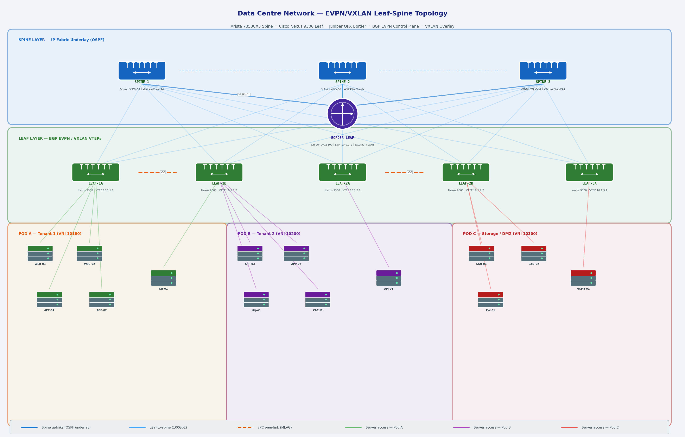

# Data Centre Networking — EVPN/VXLAN Leaf-Spine Lab

A practical data centre networking lab demonstrating a modern **leaf-spine fabric** with **BGP EVPN control plane** and **VXLAN data plane overlay**. Covers multi-tenancy, L2/L3 gateway design, vPC redundancy, and external routing via a border leaf.

Built from hands-on experience with enterprise and cloud data centre environments.

---

## Network Topology



---

## Lab Overview

| Layer | Device | Platform | Role |
|-------|--------|----------|------|
| Spine | SPINE-1/2/3 | Arista 7050CX3 | IP fabric underlay, OSPF/BGP |
| Leaf | LEAF-1A/1B/2A/2B/3A | Cisco Nexus 9300 | VTEP, EVPN, server access |
| Border | BORDER-LEAF | Juniper QFX5100 | External routing, WAN handoff |
| Servers | WEB, APP, DB, SAN... | — | Tenant workloads |

### Tenant Design

| Pod | Tenant | L2 VNI | L3 VNI | Workloads |
|-----|--------|--------|--------|-----------|
| Pod A | Tenant 1 | 10100 | 50100 | Web, App, DB |
| Pod B | Tenant 2 | 10200 | 50200 | App, MQ, Cache, API |
| Pod C | Storage/DMZ | 10300 | 50300 | SAN, Firewall, MGMT |

---

## Key Concepts Demonstrated

**Leaf-Spine Architecture** — eliminates STP, provides predictable latency and equal-cost multipath (ECMP) across all server pairs. Every leaf has equal-cost paths to every other leaf via the spine layer.

**VXLAN Overlay** — encapsulates L2 frames in UDP/IP packets, extending L2 domains across the L3 underlay fabric. Each VTEP (Virtual Tunnel Endpoint) on a leaf switch originates and terminates VXLAN tunnels.

**BGP EVPN Control Plane** — distributes MAC/IP binding information between VTEPs using BGP EVPN address families, replacing flood-and-learn with a control-plane-driven approach. Dramatically reduces BUM (Broadcast, Unknown unicast, Multicast) traffic.

**Symmetric IRB** — each leaf acts as both L2 and L3 gateway using a distributed anycast gateway. VMs can move between leaves without gateway reconfiguration.

**vPC / MLAG** — leaf pairs (LEAF-1A/1B, LEAF-2A/2B) form vPC domains for dual-homed server connectivity, eliminating single points of failure at the access layer.

**Border Leaf** — Juniper QFX5100 connects the VXLAN fabric to the external network (WAN, internet, other DCs) using EVPN Type-5 routes for external prefix advertisement.

---

## Configurations

### Underlay — OSPF on Spine (Arista EOS)

```
! SPINE-1
router ospf 1
   router-id 10.0.0.1
   passive-interface default
   no passive-interface Ethernet1
   no passive-interface Ethernet2
   no passive-interface Ethernet3
   no passive-interface Ethernet4
   no passive-interface Ethernet5
   network 10.0.0.0/8 area 0.0.0.0
   max-lsa 12000

interface Loopback0
   description Router-ID / BGP EVPN source
   ip address 10.0.0.1/32
   ip ospf area 0.0.0.0

interface Ethernet1
   description P2P-TO-LEAF-1A
   ip address 10.100.1.0/31
   ip ospf network point-to-point
   ip ospf area 0.0.0.0
   no switchport
```

---

### Overlay — BGP EVPN on Spine (Arista EOS)

```
! SPINE-1 — Route Reflector for EVPN
router bgp 65000
   router-id 10.0.0.1
   bgp listen range 10.0.0.0/8 peer-group EVPN-OVERLAY-PEERS remote-as 65000
   
   neighbor EVPN-OVERLAY-PEERS peer group
   neighbor EVPN-OVERLAY-PEERS update-source Loopback0
   neighbor EVPN-OVERLAY-PEERS route-reflector-client
   neighbor EVPN-OVERLAY-PEERS send-community extended
   neighbor EVPN-OVERLAY-PEERS maximum-routes 0
   
   address-family evpn
      neighbor EVPN-OVERLAY-PEERS activate
```

---

### VTEP & EVPN on Leaf (Cisco NX-OS)

```
! LEAF-1A
feature nv overlay
feature vn-segment-vlan-based
nv overlay evpn

! Underlay BGP
router bgp 65000
  router-id 10.1.1.1
  neighbor 10.0.0.1 remote-as 65000
    update-source loopback0
    address-family l2vpn evpn
      send-community extended

! VXLAN interface
interface nve1
  no shutdown
  host-reachability protocol bgp
  source-interface loopback1
  member vni 10100
    ingress-replication protocol bgp
  member vni 50100 associate-vrf

! VLAN to VNI mapping
vlan 100
  vn-segment 10100

! Anycast gateway (Symmetric IRB)
fabric forwarding anycast-gateway-mac 0001.0001.0001

interface Vlan100
  no shutdown
  vrf member TENANT-1
  ip address 192.168.100.1/24
  fabric forwarding mode anycast-gateway
```

---

### VRF & L3 VNI (Multi-tenancy)

```
! LEAF-1A — Tenant VRF
vrf context TENANT-1
  vni 50100
  rd auto
  address-family ipv4 unicast
    route-target both auto evpn

vlan 3967
  vn-segment 50100

interface Vlan3967
  vrf member TENANT-1
  ip forward
```

---

### vPC Configuration (Cisco NX-OS)

```
! LEAF-1A
feature vpc

vpc domain 10
  peer-keepalive destination 192.168.200.2 source 192.168.200.1
  peer-gateway
  auto-recovery

interface port-channel10
  description vPC-PEER-LINK
  switchport mode trunk
  vpc peer-link

interface port-channel20
  description DUAL-HOMED-SERVER
  switchport mode access
  switchport access vlan 100
  vpc 20
```

---

### Border Leaf — External Routing (Juniper JunOS)

```
set routing-options router-id 10.0.1.1
set routing-options autonomous-system 65000

set protocols bgp group EVPN-OVERLAY type internal
set protocols bgp group EVPN-OVERLAY local-address 10.0.1.1
set protocols bgp group EVPN-OVERLAY family evpn signaling
set protocols bgp group EVPN-OVERLAY neighbor 10.0.0.1
set protocols bgp group EVPN-OVERLAY neighbor 10.0.0.2
set protocols bgp group EVPN-OVERLAY neighbor 10.0.0.3

! Advertise external prefixes as EVPN Type-5 routes
set policy-options policy-statement EXPORT-TO-FABRIC term external-routes
set policy-options policy-statement EXPORT-TO-FABRIC term external-routes from protocol bgp
set policy-options policy-statement EXPORT-TO-FABRIC term external-routes then accept
```

---

## Verification Commands

```bash
# Arista EOS — Spine
show bgp evpn summary
show bgp evpn route-type mac-ip
show bgp evpn route-type imet

# Cisco NX-OS — Leaf
show nve peers
show nve vni
show bgp l2vpn evpn summary
show mac address-table
show ip arp suppression-cache detail

# Juniper JunOS — Border Leaf
show bgp summary
show evpn database
show route table bgp.evpn.0
```

---

## Lab Environment

This lab can be reproduced in:
- **EVE-NG** — full support for Arista vEOS, Cisco NX-OSv, Juniper vQFX
- **GNS3** — with Arista vEOS and Cisco NX-OSv images
- **Containerlab** — lightweight container-based option using cEOS (Arista)

### Containerlab quickstart

```bash
# Install containerlab
bash -c "$(curl -sL https://get.containerlab.dev)"

# Deploy topology
containerlab deploy --topo dc-lab.yml
```

---

## References

- [RFC 7432 — BGP MPLS-Based Ethernet VPN](https://www.rfc-editor.org/rfc/rfc7432)
- [RFC 8365 — A Network Virtualization Overlay Solution Using EVPN](https://www.rfc-editor.org/rfc/rfc8365)
- [Cisco NX-OS VXLAN Configuration Guide](https://www.cisco.com/c/en/us/td/docs/switches/datacenter/nexus9000/sw/vxlan_config_guide.html)
- [Arista EOS EVPN Configuration Guide](https://www.arista.com/en/um-eos/eos-evpn-overview)
- Juniper QFX EVPN-VXLAN Deployment Guide
