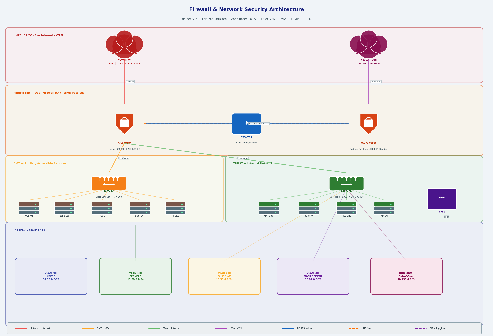

# Firewall & Network Security Architecture

A practical network security lab demonstrating enterprise-grade perimeter defence using **Juniper SRX** and **Fortinet FortiGate** in an Active/Passive HA pair. Covers zone-based security, DMZ design, IPSec VPN, IDS/IPS integration, and network segmentation.

Built from hands-on experience administering Juniper SRX and Fortinet firewalls in production environments.

---

## Network Topology



---

## Lab Overview

| Device | Platform | Role |
|--------|----------|------|
| FW-ACTIVE | Juniper SRX4200 | Primary perimeter firewall |
| FW-PASSIVE | Fortinet FortiGate 600E | Standby HA peer |
| IDS/IPS | Snort / Suricata | Inline traffic inspection |
| DMZ-SW | Cisco Catalyst | DMZ switching / VLAN 100 |
| CORE-SW | Cisco Nexus | Internal L3 core / VLANs 200-400 |
| SIEM | — | Log aggregation & correlation |

### Security Zones

| Zone | Subnet | Description |
|------|--------|-------------|
| Untrust | 203.0.113.0/30 | Internet / WAN |
| DMZ | 10.0.100.0/24 | Publicly accessible services |
| Trust | 10.10.0.0/16 | Internal corporate network |
| Management | 10.99.0.0/24 | OOB device management |
| VPN | 198.51.100.0/30 | Remote branch IPSec tunnel |

---

## Key Concepts Demonstrated

**Dual Firewall HA** — Active/Passive pair across Juniper SRX and Fortinet FortiGate ensures no single point of failure at the perimeter. Session state is synchronised via dedicated HA heartbeat link.

**Zone-Based Security Policy** — traffic is permitted or denied based on source/destination security zone, not individual interface ACLs. Makes policy easier to audit and maintain at scale.

**DMZ Architecture** — publicly accessible services (web, mail, DNS, proxy) are isolated in a dedicated DMZ segment. Inbound traffic from the internet reaches only the DMZ; direct internet-to-trust traffic is blocked by default.

**IPSec VPN** — IKEv2/IPSec tunnel provides encrypted connectivity to remote branch offices. BGP runs over the tunnel for dynamic routing.

**Inline IDS/IPS** — traffic between zones passes through an inline IDS/IPS sensor for deep packet inspection, signature-based threat detection, and anomaly alerting.

**Network Segmentation** — internal network is divided into VLANs (Users, Servers, VoIP/IoT, Management) with inter-VLAN routing controlled by firewall policy, limiting lateral movement in the event of a breach.

**SIEM Integration** — all firewall, IDS/IPS, and switch logs forwarded to SIEM for centralised correlation, alerting, and audit trail.

---

## Configurations

### Zone-Based Security Policy — Juniper SRX

```
# Define security zones
set security zones security-zone untrust interfaces ge-0/0/0.0
set security zones security-zone dmz     interfaces ge-0/0/1.0
set security zones security-zone trust   interfaces ge-0/0/2.0
set security zones security-zone mgmt    interfaces ge-0/0/3.0

# Untrust → DMZ (allow inbound HTTP/HTTPS/DNS only)
set security policies from-zone untrust to-zone dmz policy INBOUND-DMZ
set security policies from-zone untrust to-zone dmz policy INBOUND-DMZ match source-address any
set security policies from-zone untrust to-zone dmz policy INBOUND-DMZ match destination-address DMZ-SERVERS
set security policies from-zone untrust to-zone dmz policy INBOUND-DMZ match application [junos-http junos-https junos-dns-udp]
set security policies from-zone untrust to-zone dmz policy INBOUND-DMZ then permit
set security policies from-zone untrust to-zone dmz policy INBOUND-DMZ then log session-close

# DMZ → Trust (deny by default, allow specific app traffic)
set security policies from-zone dmz to-zone trust policy DMZ-TO-TRUST
set security policies from-zone dmz to-zone trust policy DMZ-TO-TRUST match source-address DMZ-SERVERS
set security policies from-zone dmz to-zone trust policy DMZ-TO-TRUST match destination-address DB-SERVERS
set security policies from-zone dmz to-zone trust policy DMZ-TO-TRUST match application junos-mysql
set security policies from-zone dmz to-zone trust policy DMZ-TO-TRUST then permit

# Untrust → Trust (deny all)
set security policies from-zone untrust to-zone trust policy DENY-ALL
set security policies from-zone untrust to-zone trust policy DENY-ALL match source-address any
set security policies from-zone untrust to-zone trust policy DENY-ALL match destination-address any
set security policies from-zone untrust to-zone trust policy DENY-ALL match application any
set security policies from-zone untrust to-zone trust policy DENY-ALL then deny
set security policies from-zone untrust to-zone trust policy DENY-ALL then log session-close

# Default deny with logging
set security policies default-policy deny-all
```

---

### NAT Configuration — Juniper SRX

```
# Source NAT — Trust to Internet (PAT)
set security nat source rule-set TRUST-TO-INTERNET from zone trust
set security nat source rule-set TRUST-TO-INTERNET to zone untrust
set security nat source rule-set TRUST-TO-INTERNET rule PAT match source-address 10.0.0.0/8
set security nat source rule-set TRUST-TO-INTERNET rule PAT then source-nat interface

# Destination NAT — Inbound to DMZ web servers
set security nat destination rule-set INBOUND-WEB from zone untrust
set security nat destination rule-set INBOUND-WEB rule HTTP-VIP match destination-address 203.0.113.2/32
set security nat destination rule-set INBOUND-WEB rule HTTP-VIP match destination-port 80
set security nat destination rule-set INBOUND-WEB rule HTTP-VIP then destination-nat pool WEB-POOL
set security nat destination pool WEB-POOL address 10.0.100.10/32 port 80
```

---

### IPSec VPN — IKEv2 to Branch Office (Juniper SRX)

```
# IKEv2 proposal
set security ike proposal IKE-PROPOSAL authentication-method pre-shared-keys
set security ike proposal IKE-PROPOSAL dh-group group14
set security ike proposal IKE-PROPOSAL authentication-algorithm sha-256
set security ike proposal IKE-PROPOSAL encryption-algorithm aes-256-cbc

# IKE policy
set security ike policy IKE-POLICY mode main
set security ike policy IKE-POLICY proposals IKE-PROPOSAL
set security ike policy IKE-POLICY pre-shared-key ascii-text "CHANGE-ME"

# IKE gateway
set security ike gateway BRANCH-GW ike-policy IKE-POLICY
set security ike gateway BRANCH-GW address 198.51.100.1
set security ike gateway BRANCH-GW local-identity inet 203.0.113.2
set security ike gateway BRANCH-GW external-interface ge-0/0/0.0
set security ike gateway BRANCH-GW version v2-only

# IPSec
set security ipsec proposal IPSEC-PROPOSAL protocol esp
set security ipsec proposal IPSEC-PROPOSAL authentication-algorithm hmac-sha-256-128
set security ipsec proposal IPSEC-PROPOSAL encryption-algorithm aes-256-cbc

set security ipsec policy IPSEC-POLICY proposals IPSEC-PROPOSAL
set security ipsec vpn BRANCH-VPN bind-interface st0.0
set security ipsec vpn BRANCH-VPN ike gateway BRANCH-GW
set security ipsec vpn BRANCH-VPN ike ipsec-policy IPSEC-POLICY
set security ipsec vpn BRANCH-VPN establish-tunnels immediately
```

---

### Fortinet FortiGate — HA Configuration

```
config system ha
    set mode a-p
    set group-name "FW-HA-PAIR"
    set group-id 1
    set password "ha-secret"
    set hbdev "port3" 50
    set session-sync-dev "port3"
    set priority 100
    set override disable
    set monitor "port1" "port2"
end
```

---

### Fortinet FortiGate — Security Policy

```
config firewall policy
    edit 1
        set name "UNTRUST-TO-DMZ"
        set srcintf "wan1"
        set dstintf "dmz"
        set srcaddr "all"
        set dstaddr "DMZ-SERVERS"
        set action accept
        set schedule "always"
        set service "HTTP" "HTTPS" "DNS"
        set logtraffic all
        set utm-status enable
        set ips-sensor "default"
        set ssl-ssh-profile "certificate-inspection"
    next
    edit 2
        set name "DENY-UNTRUST-TO-TRUST"
        set srcintf "wan1"
        set dstintf "internal"
        set srcaddr "all"
        set dstaddr "all"
        set action deny
        set logtraffic all
    next
end
```

---

### Network Segmentation — VLAN Design (Cisco Nexus)

```
! VLAN definitions
vlan 100
  name DMZ
vlan 200
  name USERS
vlan 300
  name SERVERS
vlan 400
  name VOIP-IOT
vlan 500
  name MANAGEMENT

! SVI interfaces with ACLs
interface Vlan200
  description USER-SEGMENT
  ip address 10.10.0.1/24
  ip access-group USERS-IN in

! Inter-VLAN ACL — Users cannot reach Servers directly
ip access-list USERS-IN
  10 deny ip 10.10.0.0/24 10.20.0.0/24
  20 permit ip 10.10.0.0/24 any
```

---

## Verification Commands

```bash
# Juniper SRX
show security policies
show security zones
show security flow session
show security ike security-associations
show security ipsec security-associations
show security nat source summary
show log messages | match RT_FLOW

# Fortinet FortiGate
get system ha status
diagnose sys session list
diagnose vpn ike status
get firewall policy
execute log display

# Cisco Nexus — VLAN verification
show vlan
show ip interface brief
show access-lists
```

---

## Security Best Practices Demonstrated

- **Default deny** — all traffic denied unless explicitly permitted
- **Least privilege** — zones only permit traffic required for business function
- **Defence in depth** — multiple security layers (perimeter FW, IDS/IPS, segmentation, SIEM)
- **Logging** — all permit and deny decisions logged for audit and incident response
- **HA redundancy** — no single point of failure at the perimeter
- **Encrypted remote access** — IKEv2/IPSec with AES-256 and SHA-256
- **OOB management** — dedicated management VLAN isolated from production traffic

---

## Lab Environment

Reproducible in:
- **EVE-NG** — Juniper vSRX, Fortinet FortiGate VM, Cisco Catalyst/Nexus
- **GNS3** — with vSRX and FortiGate images
- **Fortinet FortiGate VM** — free evaluation licence available from Fortinet

---

## References

- [Juniper SRX Security Policy Guide](https://www.juniper.net/documentation/us/en/software/junos/security-policies/)
- [Juniper SRX IPSec VPN Configuration Guide](https://www.juniper.net/documentation/us/en/software/junos/vpn-ipsec/)
- [Fortinet FortiGate Administration Guide](https://docs.fortinet.com/product/fortigate)
- [RFC 7296 — IKEv2](https://www.rfc-editor.org/rfc/rfc7296)
- [NIST SP 800-41 — Guidelines on Firewalls and Firewall Policy](https://csrc.nist.gov/publications/detail/sp/800-41/rev-1/final)
